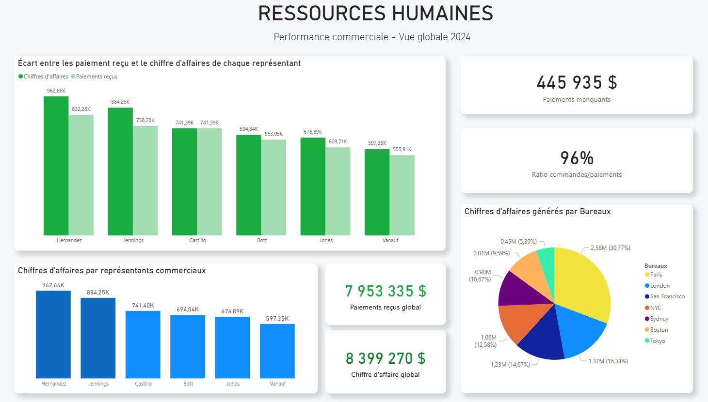
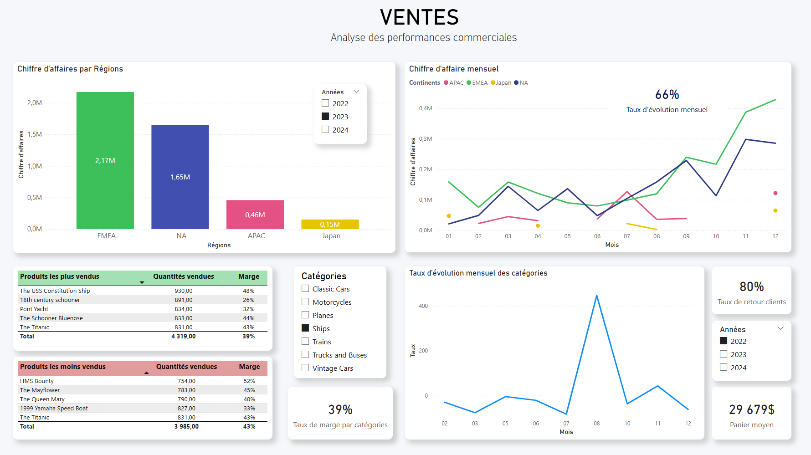
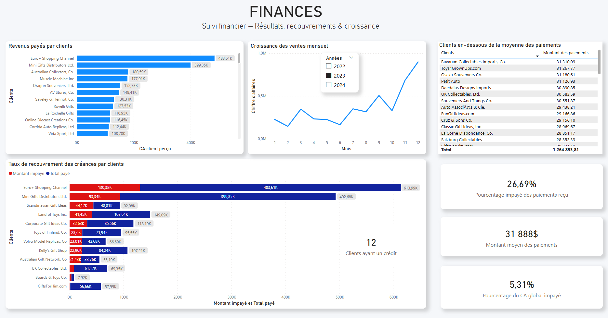
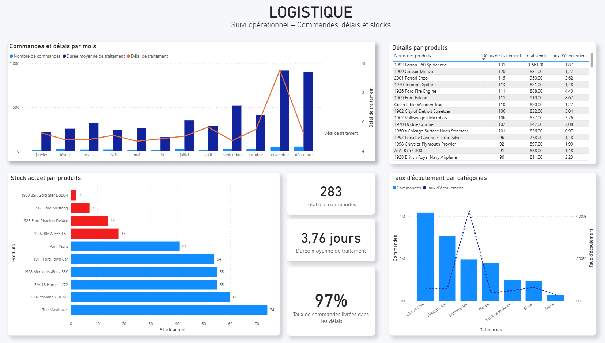

# 🚗 Projet Toys & Models

## 📌 Contexte

**Vous êtes mandaté par une entreprise qui vend des modèles et des maquettes.**

L’entreprise possède déjà une base de données qui répertorie les employés, les produits, les commandes et bien plus encore. Vous êtes invité à explorer et découvrir cette base de données.

**Le directeur de l’entreprise souhaite avoir un tableau de bord dynamique qu’il pourrait actualiser chaque matin pour obtenir les dernières informations afin de gérer l’entreprise.**

---

## 🧩 Objectifs & Enjeux

Votre tableau de bord doit s’articuler autour de ces 4 sujets principaux : **ventes, finances, logistique, et ressources humaines.**

Les indicateurs clés de performance (KPI) ci-dessous sont requis pour ce tableau de bord, avec une distinction claire entre les priorités définies par le client :

- 🔴 Rouge : Indicateurs obligatoires
- 🟢 Vert : Indicateurs complémentaires
- ⚫ Noir : Indicateurs optionnels

---

## 🧭 Indicateurs Clés de Performance (KPI)

### 👫 Ressources humaines
- 🔴 **Performance des représentants commerciaux :** Calculer le chiffre d’affaires généré par chaque employé chargé des ventes.
- 🟢 **Ratio commandes/paiements par représentant commercial :** Identifier les écarts entre les commandes passées et les paiements reçus pour chaque représentant.
- 🟢 **Performance des bureaux :** Mesurer le chiffre d’affaires généré par chaque bureau.

### 🛒 Ventes
- 🔴 **Chiffre d’affaires par mois et par région + taux d’évolution mensuel :** Suivre les revenus générés par région et par mois pour identifier les tendances géographiques.
- 🔴 **Produits les plus/moins vendus par catégorie :** Identifier les produits les plus performants dans chaque catégorie.
- 🟢 **La marge brute par produit et par catégorie :** Mesurer la marge brute et en déduire les produits/catégories les plus/moins rentables.
- ⚫ **Taux d’évolution mensuel des ventes par catégorie :** Mesurer la performance de chaque catégorie de produit dans le temps.
- ⚫ **Panier moyen :** Mesurer le panier moyen des commandes.
- ⚫ **Taux de retour des clients (repeat customers) :** Mesurer la fidélité des clients en identifiant ceux qui passent plusieurs commandes.

### 📊 Finances
- 🔴 **Clients générant le plus/moins de revenus :** Identifier les clients générant le plus de revenus pour mieux les fidéliser.
- 🟢 **Taux de recouvrement des créances par client :** Identifier les clients ayant un montant élevé de commandes non payées.
- ⚫ **Croissance des ventes par trimestre :** Identifier les tendances saisonnières ou les opportunités de croissance.
- ⚫ **Montant moyen des paiements + clients en dessous de la moyenne :** Évaluer la capacité de paiement des clients.
- ⚫ **Taux de paiement par délai :** Identifier combien de temps les clients mettent pour payer après une commande.
  
### 🚚 Logistique
- 🔴 **Stock des produits sous seuil critique :** Identifier les produits dont le stock est faible pour éviter les ruptures.
- 🟢 **Durée moyenne de traitement des commandes + commandes au-dessus de la moyenne de livraison :** Mesurer l’efficacité opérationnelle en analysant le temps entre la date de commande et la date d’expédition.
- ⚫ **Taux d’écoulement des stocks :** Mesurer la rapidité avec laquelle les stocks sont vendus pour chaque produit.
- ⚫ **Taux de commandes livrées en retard :** Identifier les problèmes logistiques et améliorer les délais de livraison.

## Dashboards KPI & Méthode AGILE

---

## 🛠️ Outils Utilisés  
- **Base de données** : MySQL Workbench / DBeaver
- **Langages** : SQL
- **Visualisation** : Power BI / Tableau

## ⭐ Projet réalisé par :
- Mourad B.
- Johane D.
- Paul P.
- Eddy F.
